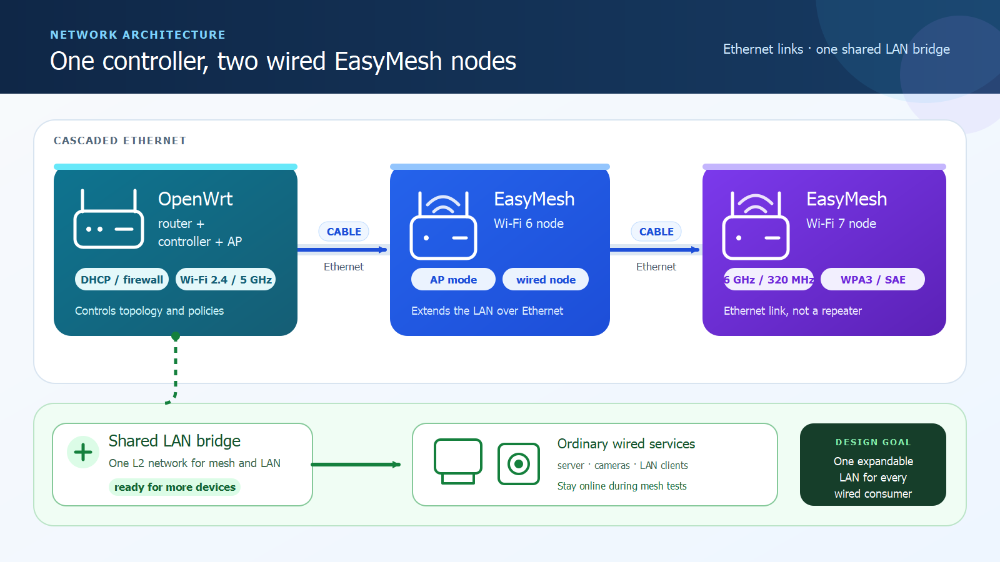
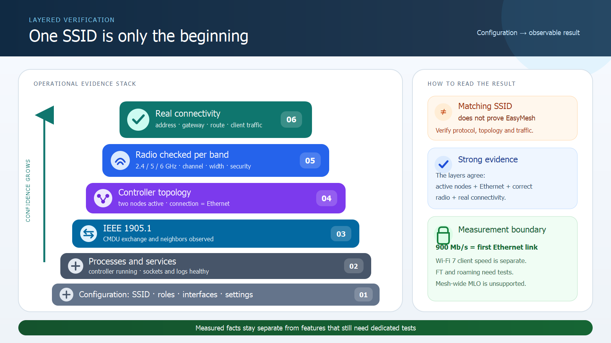

# Budget Wi-Fi 7 Mesh on OpenWrt: Xiaomi AX6S and Mercusys

**[Русская версия для Хабра](docs/habr-ru.md)** · **[Latest binary release](https://github.com/krotname/openwrt-prplmesh-easymesh/releases/latest)**


I wanted the useful parts of an expensive mesh kit without paying for three premium boxes or replacing an open router with a closed controller. So I selected the least expensive device I could find for each job:

- **Xiaomi Redmi Router AX6S** as an inexpensive, well-supported Wi-Fi 6 platform bought specifically for OpenWrt;
- **Mercusys MR60X** as the low-cost Wi-Fi 6 coverage node;
- **Mercusys MR47BE v2** as an affordable route to Wi-Fi 7, a dedicated 6 GHz radio, WPA3-SAE and 320 MHz channels.

The result is a three-node network under one SSID. OpenWrt remains the only router and DHCP server, both Mercusys devices receive their network over Ethernet, and the farthest node provides tri-band Wi-Fi 7. A measured controller-to-MR60X path reached **904.32 Mbit/s** in one direction and **893.84 Mbit/s** in the other.

OpenWrt was attractive for more than mesh. The same router also gives my network hot failover between two Internet providers and policy-routed VPN access through PAC rules and several exit nodes. Those are subjects for separate articles; here I keep the focus on building a useful mixed-vendor mesh for little money.

## The hardware and the budget

Prices were checked in Russia on 21 July 2026 and are intentionally rounded to the nearest thousand roubles. Marketplace offers, bank discounts and availability change constantly, so the links are evidence of the observed listings rather than a permanent price guarantee.

| Device | Why I chose it | Approximate price |
|---|---|---:|
| **Xiaomi Redmi Router AX6S** | Low-cost Wi-Fi 6 platform with good OpenWrt support | **about ₽5,000**. The exact [Megamarket listing](https://megamarket.ru/catalog/details/wi-fi-router-xiaomi-redmi-ax6s-chernyy-30030330-600012695478/) is currently sold out; [IQMI](https://iq-mi.ru/catalog/gadzhety_ustroystva/routery/3024/) provides a current replacement-cost reference |
| **Mercusys MR60X** | Inexpensive Wi-Fi 6 coverage and Gigabit Ethernet | **about ₽2,000** on [Ozon](https://www.ozon.ru/product/marshrutizator-besprovodnoy-mercusys-mr60x-chernyy-1687671098/) |
| **Mercusys MR47BE** | The cheapest option in my selection for tri-band Wi-Fi 7, 6 GHz and 320 MHz | **about ₽10,000** on [Ozon](https://www.ozon.ru/product/besprovodnoy-marshrutizator-mercusys-mr47be-wi-fi-7-802-11be-9214mbit-s-2-4ggts-5ggts-6ggts-3xglan-3521842630/) |

That is roughly **₽17,000 for all three nodes**. The AX6S is no longer a current marketplace model, but it remains the device around which this build was designed. Always confirm the hardware revision with the seller.

Mercusys specifies the [MR60X](https://www.mercusys.com/ru/product/wifi-router/mr60x/v2.20/) as an AX1500 dual-band device. The [MR47BE v2](https://www.mercusys.com/ru/product/wifi-router/mr47be/v2/) is a BE9300 tri-band model with 6 GHz and 320 MHz support. BE9300 is the aggregate radio class, not a promise of 9.3 Gbit/s to one client.

## The topology

```text
Internet
   |
Xiaomi Redmi AX6S
OpenWrt: routing + DHCP + Wi-Fi + mesh control
   |
   | Ethernet
   v
Mercusys MR60X: Wi-Fi 6
   |
   | Ethernet
   v
Mercusys MR47BE: Wi-Fi 7, including 6 GHz
```



The AX6S is the only gateway and DHCP server. Both Mercusys units are part of the same LAN, so there is no second NAT layer, competing DHCP service or hidden subnet. The controller sees two distinct EasyMesh nodes and reports an Ethernet connection for each one.

This distinction matters. Giving three access points the same SSID and password can make the client list look tidy, but it does not prove that a controller knows about the nodes or that the wired path is being used. Here the controller topology, the IEEE 1905.1 exchange and the live traffic path agree with one another.

The Ethernet layout is deliberately expandable. The branch behind the MR60X can also carry computers, servers, switches and future access points. Everything remains in the main OpenWrt bridge, so adding an ordinary wired client does not require renumbering the network or creating another routing domain.

## Making prplMesh fit stock OpenWrt

The AX6S runs OpenWrt 25.12.5 with Linux 6.12.94. I built the first public revision of `prplmesh-stock 6.0.1` around the normal OpenWrt model: UCI remains the configuration layer, Linux bridge owns the LAN, and the existing hostapd/wpad installation keeps control of the radios. Installing a complete prplOS stack was unnecessary.

The interesting compatibility problem was the hostapd control socket. A plain upstream control client could send a command but could not reliably receive the reply inside OpenWrt's sandbox. The radio-management process then timed out and restarted, leaving the topology empty. The package fixes that at source level by applying the corresponding OpenWrt permission patch to the pinned hostapd control-client source before prplMesh is compiled.

The public build recipe therefore does four useful things:

1. pins the prplMesh and hostapd inputs;
2. verifies the unmodified control-client source before patching;
3. applies a minimal, reviewable patch series;
4. verifies that the package does not replace `wpad`, `hostapd` or `wpa_supplicant`.

The [build recipe and patches](docs/revision-1.md) are kept next to the [ready-to-install APK and SHA-256 file](https://github.com/krotname/openwrt-prplmesh-easymesh/releases/latest), so the binary can be checked against the documented inputs rather than treated as an opaque attachment.

## Repeating the build

The released APK targets **OpenWrt 25.12 on `aarch64_cortex-a53`**, the architecture used by this AX6S build. It is not a universal package for every OpenWrt router. Check `ubus call system board` and `apk --print-arch` first, download the APK and checksum from the latest release, verify SHA-256, copy the file to a temporary directory, then install it offline with `apk --network=no --allow-untrusted add <package-path>`. Replace every demonstration value in `/etc/config/prplmesh`, map the wireless sections and hostapd sockets to the local device, set `prplmesh.config.enabled=1`, and run `/etc/init.d/prplmesh enable && /etc/init.d/prplmesh start`. The release notes contain the exact filename and compatibility boundary.

The package ships disabled and its public example contains no private SSID, password, address or hardware identifier. That is intentional: enabling a radio-control service with copied credentials would be a much worse default than requiring five minutes of local configuration.

## Getting 6 GHz right

The MR47BE's 6 GHz radio required a stricter check than simply searching for a familiar network name. Each band is read separately and the full SSID is compared, so a similarly named profile with a suffix cannot be mistaken for the target network.

The final read-back from the MR47BE confirmed:

- the expected shared SSID;
- the 6 GHz band;
- WPA3-SAE;
- 320 MHz channel width;
- the expected MR47BE hardware identity.

Some 6 GHz settings remain vendor-local in the Mercusys firmware, so a narrow convergence check watches that exact radio profile. It discovers the device's current management address, validates its identity, compares the complete band settings and touches only the allowlisted fields when drift is detected. After one correction, repeated checks at 12, 60 and 180 seconds required no further change.

## What was actually measured



| Check | Observed result |
|---|---|
| Two Mercusys nodes in the controller topology | Both active; Ethernet reported for both |
| MR47BE 6 GHz profile | Shared SSID, WPA3-SAE, 320 MHz |
| AX6S → MR60X wired path | 904.32 / 893.84 Mbit/s |
| Recovery after a hardware restart | 19/19 acceptance checks |
| Recovery after restarting mesh control | 19/19, no skipped checks |

Almost 900 Mbit/s is close to the practical limit of a Gigabit Ethernet link after protocol overhead. It is a measured result for the first wired segment, not a Wi-Fi 7 client benchmark. The second Ethernet segment has not yet been throughput-tested.

A separate read-only audit found that the client and the installed OpenWrt stack support 802.11r/FT, but FT is not enabled in the current OpenWrt profile: the association uses a non-FT AKM and the runtime has no mobility domain or FT parameters. The stock Mercusys interfaces did not provide proof of an active FT profile either. I therefore do not claim mesh-wide FT roaming. Closing that gap requires consistent configuration on every node and a walking test that records BSSID, AKM, latency and packet loss. Mesh-wide MLO is not achievable on this hardware: the Xiaomi AX6S and Mercusys MR60X are Wi-Fi 6 devices without EHT/MLO. Only local MLO on the MR47BE with a compatible client remains a separate candidate for measurement.

## Why this build is interesting

This is not a compromise assembled from leftover routers. Each device was bought for a particular price/performance role: an open Wi-Fi 6 router at the centre, an inexpensive Wi-Fi 6 node for coverage, and an affordable Wi-Fi 7 node for 6 GHz and 320 MHz. The result keeps one expandable LAN, nearly fills the tested Gigabit path and automatically reconstructs the two-node topology after service restarts.

It also keeps control of the network where I want it. OpenWrt can grow with dual-provider failover, policy routing, VPN exits, monitoring and ordinary wired services without forcing every future feature into one vendor's controller.

I publish deeper engineering notes for developers, architects and team leads in [Java && Management](https://t.me/management_Java). My technical-audit work and other projects are collected at [krot.name](https://krot.name/), while source code and reproducible artifacts live on [GitHub](https://github.com/krotname).

## Author links

- Telegram: [Java && Management](https://t.me/management_Java)
- Website: [krot.name](https://krot.name/)
- GitHub profile: [github.com/krotname](https://github.com/krotname)
- This project: [krotname/openwrt-prplmesh-easymesh](https://github.com/krotname/openwrt-prplmesh-easymesh)
- Binary release: [latest APK and checksums](https://github.com/krotname/openwrt-prplmesh-easymesh/releases/latest)

---

Prices and availability were checked on 21 July 2026 and rounded to the nearest thousand roubles. Article structure and illustrations were prepared with generative-AI assistance from the author's logs and measurements; technical claims were checked against the recorded acceptance evidence.
