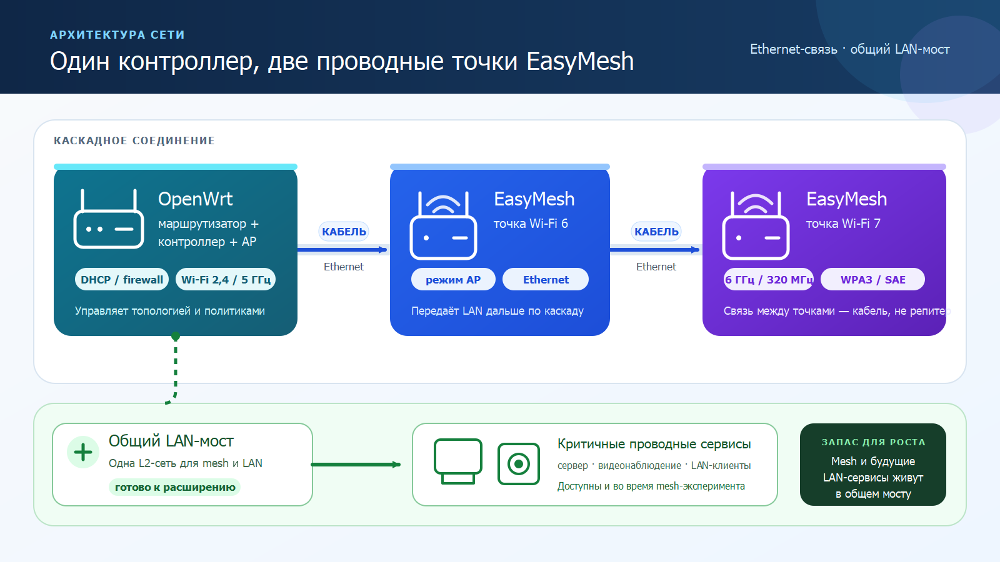
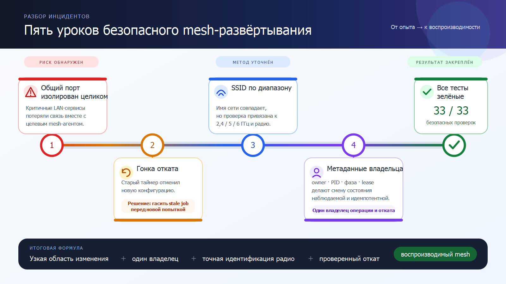
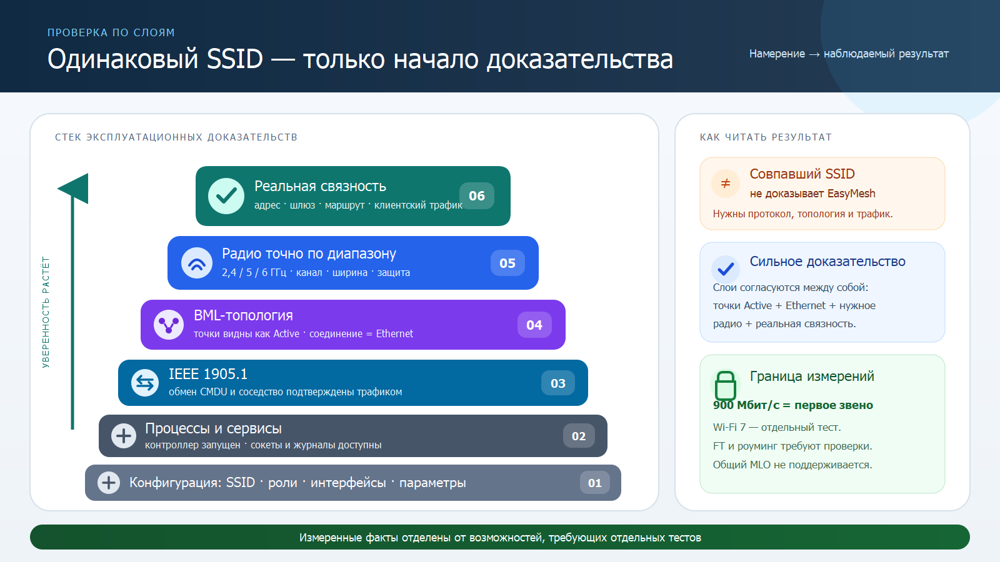

# Wired third-party EasyMesh agents with prplMesh on OpenWrt

**[Русская версия для Хабра](docs/habr-ru.md)** · **[Publication checklist](docs/publication-checklist.md)**


Status: sanitized technical report, not a ready-to-post forum article
Evidence checkpoint: 2026-07-21

## Abstract

This experiment tested whether an OpenWrt router could remain the only router,
DHCP server, and default gateway while also running prplMesh 6.0.1 as the mesh
controller and a local access point. Two proprietary EasyMesh devices were
attached as agents over a cascaded Ethernet backhaul; the farther agent also
provided a 6 GHz Wi-Fi 7 radio.

At the recorded checkpoint, both agents appeared in the controller topology as
active Ethernet neighbors, the expected common SSID was visible on the tested
radios, unrelated wired LAN services remained reachable, and one
controller-to-near-agent wired path carried 904.32 Mbit/s in one direction and
893.84 Mbit/s in the other. This is useful interoperability evidence, but it is
not certification and it does not imply support for every EasyMesh feature.

At the final acceptance checkpoint, both agents returned Active/Ethernet after
a controller restart. They were downstream of one occupied controller-side LAN
uplink at 1000/full, while another main-bridge port was intentionally idle with
no carrier. LiveSafe r8 passed 19/19 with no skips. This link-state observation
does not establish the speed of the second cascaded segment.

## Scope and tested architecture

```text
                         routing, NAT, DHCP
Internet --------------- OpenWrt controller/AP
                              |
                         shared LAN bridge
                              |
                        Ethernet backhaul
                              |
                       EasyMesh agent A
                              |
                        Ethernet backhaul
                              |
                       EasyMesh agent B
                       (includes 6 GHz)
```



*The critical boundary is the shared LAN bridge: isolate the mesh protocol path, not the whole physical downstream port.*

The OpenWrt installation retained its normal Linux bridge and UCI network
model. prplMesh was packaged locally for that environment; a complete prplOS,
WHM, or Ambiorix platform was not installed. The proprietary agents retained
their vendor firmware.

The interoperability boundary was therefore IEEE 1905.1/EasyMesh control
traffic plus Ethernet backhaul. Vendor-specific management remained outside
the controller where a standardized operation was unavailable.

## What was observed

| Area | Recorded evidence | Result |
|---|---|---|
| Controller | Controller and IEEE 1905 transport processes stayed running | Pass |
| Topology | Two distinct agents appeared active with Ethernet backhaul | Pass |
| LAN | Router, both agents, and unrelated wired services remained reachable | Pass |
| Current bridge/link state | One occupied controller-side uplink remained in the main LAN bridge at 1000/full; another bridge member was intentionally idle with no carrier | Pass for the occupied uplink only |
| WLAN | The exact expected SSID was reported on 2.4 and 5 GHz radios | Pass with profile limitation |
| 6 GHz | The farther agent reported the expected SSID, WPA3-SAE, and 320 MHz operation | Pass with profile limitation |
| First wired path | Controller-to-near-agent test measured 904.32 Mbit/s in one direction and 893.84 Mbit/s in the other | Pass for this path only |
| Second wired path | Near-agent-to-far-agent throughput was not measured | Not run |
| 802.11r | Fast transition was disabled on the OpenWrt access point; cross-vendor FT was not demonstrated | Not enabled or proven |
| MLO | The OpenWrt access point and Wi-Fi 6 agent lack EHT/MLO capability | Impossible mesh-wide on unchanged hardware |
| Backup | Configuration archive was downloaded, hashed, enumerated, and restored only into an isolated test filesystem | Pass with limitation |
| Deployed package | prplMesh 6.0.1-r8 with the source-level hostapd control-socket fix | Pass after install and hardware reboot |
| r8 source and artifact QA | Hostapd compatibility suite 9/9; APK artifact suite 11/11 | Pass |
| Historical r8 hardware-reboot persistence | Boot identity changed; SSH listeners on TCP 22 and 2222 returned in about 19 seconds; two Ethernet agents returned in about 35 seconds; `lan2` and `lan3` remained in the main bridge at 1000/full | Pass for that earlier sequence |
| Historical post-hardware-reboot acceptance | Required processes and sockets returned; two agents were active over Ethernet | 19/19 pass |
| Final controller-restart acceptance | Both agents returned Active/Ethernet behind the occupied uplink; required LAN services remained reachable | LiveSafe r8 19/19, no skips |
| 6 GHz vendor-profile guard | Exact radio identity, dynamic address discovery, backup gate, and one allowlisted combined write restored the exact expected SSID, WPA3-SAE, and 320 MHz; 12/60/180-second checks were NOOP | Live-verified fail-closed compensating control |
| Walking roam | The physical walking-roam test was skipped and not run | Not run |
| Physical restore | No destructive restore onto router hardware has been performed | Pending |

The throughput observation applies only to the first measured path. It is not
evidence for the second cascaded path or for every Ethernet segment.

The hardware-reboot and final controller-restart rows are separate checkpoints.
The latter proves current convergence after a controller restart; it does not
retroactively extend the earlier reboot test or prove 1000/full on the
agent-to-agent segment.

An identical SSID does not establish an identical security or roaming profile.
At this checkpoint, the observed OpenWrt client association used WPA2-Personal,
PSK-SHA256, and 802.11ax, while the farther agent's 6 GHz radio reported
WPA3-SAE and 320 MHz. Consequently, 6 GHz roaming, FT, and MLO remain unproven.

## Safe deployment method

### 1. Capture a baseline

Before changing mesh state, record:

- OpenWrt release, kernel, hardware model, and installed prplMesh package;
- bridge membership and interface link state;
- DHCP leases and current agent addresses;
- controller and transport process state;
- reachability of every service sharing the physical backhaul port;
- existing wireless SSIDs and security modes.

Treat dynamically leased addresses as observations, not stable identity. Match
agents by controller topology identity and Ethernet adjacency as well as by
their current management address.

### 2. Prove the rollback artifact

A downloaded archive is not yet a proven backup. At minimum:

1. calculate and retain a cryptographic hash;
2. enumerate the archive without errors;
3. reject unexpected owners, paths, or missing critical members;
4. extract into an isolated filesystem;
5. compare restored critical files with the source snapshot;
6. document that a physical-device restore remains untested unless it was
   actually performed.

Do not claim a hardware restore from an extraction-only test.

### 3. Preserve the main LAN bridge

The physical Ethernet port carrying the mesh backhaul may also carry ordinary
LAN devices. Moving that entire port into a temporary mesh-only bridge can
disconnect unrelated systems even when the mesh agents themselves remain
reachable.

Before any bridge mutation, enumerate downstream MAC addresses and leases.
Prefer a narrow test that leaves the shared physical port in the main bridge.
If isolation is truly required, first provide a separate physical port or a
deliberately designed VLAN topology.

### 4. Keep one routing authority

OpenWrt remains the only router and DHCP server. Put proprietary devices into
their access-point/EasyMesh-agent operating mode so that they do not introduce
another NAT or DHCP domain. Verify this from the LAN, rather than relying only
on a label in a vendor interface.

### 5. Add agents one at a time

For each agent:

1. connect power and the intended Ethernet backhaul;
2. start the vendor-supported onboarding window;
3. trigger the controller onboarding action once;
4. wait for an active Ethernet adjacency;
5. verify exact SSID and security read-back;
6. retest all unrelated services before adding the next agent.

Repeated button presses or overlapping onboarding windows make the resulting
state difficult to attribute. A single, bounded attempt followed by read-back
produces better evidence.

### 6. Validate exact radio state

A collapsed or substring-based wireless check can hide a wrong 6 GHz SSID.
Validate each band independently and require exact equality. Account for
localized band labels and verify that an unexpected duplicate or suffix does
not pass simply because it contains the desired name.

## Acceptance checks

The following checks are suitable for a non-disruptive acceptance harness:

1. active intended management path, either negotiated Ethernet or the exact
   intended WLAN;
2. controller, both agents, and critical LAN endpoints reachable;
3. expected OpenWrt model, release, and prplMesh package present;
4. controller, agent, transport, and fronthaul processes healthy;
5. required control sockets listening;
6. all shared physical ports still members of the main LAN bridge;
7. no unfinished transition lock or rollback timer active;
8. expected SSID present exactly once per intended radio role;
9. two distinct agents active with Ethernet backhaul;
10. current backup manifest, archive hash, restore-test result, and scheduled
    backup job healthy.

Tests that should remain manual or explicitly disruptive include walking roam
measurements, cable removal, power interruption, factory reset, firmware
upgrade, and a restore onto physical hardware.

## Regression cases that found real defects



### Shared-port isolation

**Failure:** a temporary bridge moved the complete downstream Ethernet port out
of the LAN bridge. Unrelated services behind that port disappeared.

**Correction:** restore the port to the main bridge and redesign tests around
the individual mesh protocol path, not the whole shared wire.

**Regression:** fail acceptance if any required physical port leaves the main
bridge or if any declared critical endpoint becomes unreachable.

### Backup archive ownership

**Failure:** configuration content was correct, but one file or symbolic link
was archived with a non-root group owner. A strict restore verifier rejected
the backup.

**Correction:** preserve content, make a scoped metadata backup, correct only
the owner, and rerun archive and isolated-restore verification.

**Regression:** inspect actual archive members, including symbolic links; do not
assume a configuration-file listing covers every archived path.

### Ambiguous radio selection

**Failure:** a fallback configuration lookup could choose an arbitrary access
point when more than one section matched broadly.

**Correction:** fail closed unless exactly one access-point section matches.

**Regression:** cover zero, one, and multiple candidate sections in a pure unit
test.

### Stale-process and stale-log false positives

**Failure:** a controller-only health check or an old transport log could make a
partial stack appear healthy.

**Correction:** require controller, transport, and agent liveness and remove the
old probe log before each isolated run.

**Regression:** kill each component independently and require the stack probe to
fail.

### Permissive MAC parsing

**Failure:** a frame generator accepted a valid-looking MAC followed by trailing
characters.

**Correction:** require the exact 17-character canonical form before emitting a
frame.

**Regression:** normalize only the non-deterministic Message ID, compare every
other byte with a golden frame, and reject short, long, malformed, or
trailing-garbage input.

### Management-session leakage

**Failure:** a diagnostic command could expose a login token or leave a vendor
management session open.

**Correction:** print only non-secret status, restrict read commands to an
allowlist, scope relaxed certificate handling to the device client when
required, and perform best-effort logout in a `finally` path.

**Regression:** capture stdout, reject secret-like response fields, attempt a
forbidden mutation operation, and assert logout after success and failure.

## Automated test layers



The work used complementary layers rather than treating one emulator as proof
of radio behavior:

- fixture tests for topology parsing, localized band labels, DHCP address
  drift, exact SSID matching, and backup-manifest validation;
- live, read-only acceptance checks for bridge membership, reachability,
  processes, sockets, radio read-back, and controller adjacency;
- Python unit tests for the constrained vendor-management reader;
- native C/C++ tests for frame generation and deterministic configuration
  selection;
- OpenWrt-target cross-compilation syntax checks for changed production code;
- isolated filesystem restore checks for configuration backups.

The earlier combined non-mutating fixture and live suite passed 33 of 33 checks
with no skips. The constrained vendor reader passed 8 of 8 unit tests, and the
native prplMesh set passed 9 of 9 test binaries after the modified unit was
rebuilt from the current source.

The final deployed artifact is r8. Its hostapd control-socket source
compatibility suite passed 9 of 9 cases and its APK artifact suite passed 11 of
11. The package passed offline integrity and extraction checks, contained 32
payload files, and did not replace the system `wpad`, `hostapd`, or
`wpa_supplicant` binaries. At the earlier hardware-reboot checkpoint, the
reboot changed the boot identity.
Normal and recovery SSH listeners on TCP 22 and 2222 returned in about 19
seconds, both proprietary agents returned as active Ethernet neighbors in about
35 seconds, `lan2` and `lan3` remained in the main LAN bridge at 1000/full, and
the complete post-reboot live acceptance suite passed 19 of 19 checks.

At the later final controller-restart checkpoint, one occupied controller-side
LAN uplink remained in the main bridge at 1000/full, another bridge member was
idle with no carrier, both agents returned as active Ethernet neighbors, and
LiveSafe r8 passed 19 of 19 checks with no skips. This is current topology
evidence, not a second hardware-reboot test and not a throughput result for the
agent-to-agent segment.

### Source regression found by the reproducible build

The reproducible r6 build exposed a runtime defect rather than completing the
deployment. The package built its wireless control library against pristine
upstream hostapd sources but omitted OpenWrt's control-client socket permission
patch. The sandboxed hostapd process received `STATUS` requests but could not
reply to the client-created socket; both fronthaul processes then timed out and
restarted, leaving the controller topology empty.

r8 fixes the cause in source. The recipe pins the upstream hostapd input,
verifies it before patching, applies the official OpenWrt
`610-hostapd_cli_ujail_permission.patch`, and verifies the patched result. The
patch adjusts the local UNIX control socket mode and ownership so the sandboxed
daemon can reply. The recipe also uses the SDK's explicit host `mkhash` tool
instead of relying on an undefined build macro. See the
[sanitized r8 engineering note](docs/r8-hostapd-control-socket-fix.md).

## Claims this evidence does not support

Do not infer any of the following from the recorded result:

- Wi-Fi Alliance EasyMesh certification;
- complete vendor interoperability;
- 802.11r fast transition: it was disabled on the OpenWrt access point, and a
  compatible cross-vendor mobility domain and FT security profile were not
  demonstrated;
- mesh-wide MLO: the OpenWrt access point and Wi-Fi 6 agent do not provide
  EHT/MLO, so the unchanged three-device topology cannot offer it;
- zero-packet-loss or imperceptible client roaming;
- controller ownership of every vendor-specific 6 GHz setting;
- native prplMesh enforcement of the vendor-managed 6 GHz profile: the agent
  does not expose a controller-visible 6 GHz radio identifier, so the verified
  guard is a separate compensating control rather than a core mesh feature;
- gigabit negotiation or throughput on every Ethernet segment: 1000/full is
  current evidence only for the occupied controller-side uplink, and the
  second cascaded path was not throughput-tested;
- successful disaster recovery onto physical hardware;
- resilience to every reboot, cable, power, or firmware-upgrade sequence; one
  r8 hardware reboot passed, which is evidence only for that tested sequence.

The physical walking test was skipped and not run. A future test with
packet-loss, association, BSSID, and latency telemetry is required before
making a practical seamless-roaming claim. The second wired path was also not
throughput-tested; neither result can be inferred from the first-path
measurement.

## Reproducibility and source provenance

The final r8 package was built offline from a pinned OpenWrt SDK, immutable
upstream inputs, and a reviewable source patch. The resulting APK is 4,537,338
bytes, and its complete artifact identity was verified before installation.
Artifact identity supports provenance but does not replace source review or
live testing.

OpenWrt's APK v3 workflow signs the repository index rather than each
individual package. The individual APK passed offline integrity and extraction
checks, and freshly generated repository indexes passed trust verification
with the matching public test key. The private test key is not part of this
public repository and must not be treated as a production release key.

A publishable package recipe should contain an upstream source URL, immutable
commit or release tag, hashes where applicable, and a reviewable patch series.
A local source-directory override is not reproducible and must not be published
as the package recipe.

prplMesh 6.0.1 carries a BSD-2-Clause-Patent project license while parts of its
source tree use additional BSD, ISC, or MIT notices. Preserve upstream
`LICENSE`, `LICENSES`, `AUTHORS`, copyright, and SPDX material. Review the
package metadata so it does not incorrectly reduce a mixed-license tree to a
single incomplete declaration.

Potential upstream contributions should follow the
[prplMesh project](https://gitlab.com/prpl-foundation/prplmesh/prplMesh)
workflow, including its issue-tracking, Developer Certificate of Origin,
`Signed-off-by`, authorship, and source-header requirements.

## Publication safety

Publish from an explicit allowlist, not by copying a working directory. Exclude
private configuration, backups, logs, packet captures, firmware blobs,
proprietary web resources, device-label images, credentials, tokens, real
network identifiers, and management-session material.

This article was prepared with generative-AI assistance. It is not suitable for
verbatim submission to the OpenWrt Forum. See the
[forum evidence note](docs/forum-evidence.md) and re-check the
[current forum guidelines](https://forum.openwrt.org/guidelines) before writing
an independent, personally verified post.
